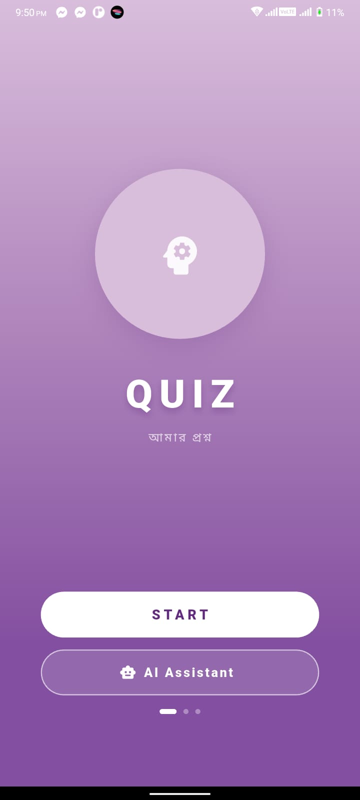
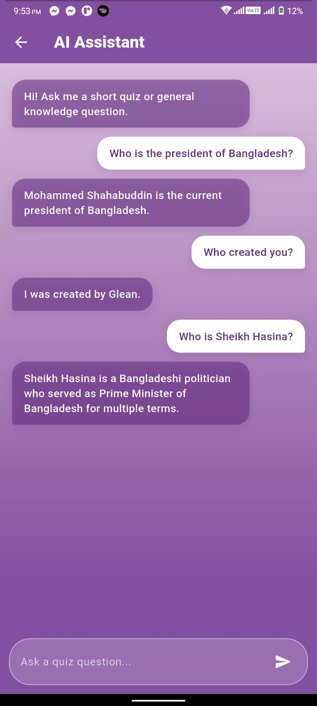

# Amar Proshno

### Flutter Quiz Application with Firebase Authentication & AI Assistant

*A modern and beautifully designed Flutter quiz application with secure user authentication and an AI-powered chat assistant, built as an assignment project.*

---

## 📱 Screenshots

<div align="center">
  <table>
    <tr>
      <td align="center">
        <strong>🔐 Login Screen</strong>
      </td>
      <td align="center">
        <strong>📝 Sign Up Screen</strong>
      </td>
      <td align="center">
        <strong>🏠 Home Screen</strong>
      </td>
    </tr>
    <tr>
      <td align="center">
        
      </td>
      <td align="center">
        
      </td>
      <td align="center">
        
      </td>
    </tr>
  </table>
</div>

<div align="center">
  <table>
    <tr>
      <td align="center">
        <strong>❓ Quiz Screen</strong>
      </td>
      <td align="center">
        <strong>📊 Result Screen</strong>
      </td>
      <td align="center">
        <strong>🤖 AI Assistant Screen</strong>
      </td>
    </tr>
    <tr>
      <td align="center">
        
      </td>
      <td align="center">
        
      </td>
      <td align="center">
        
      </td>
    </tr>
  </table>
</div>

---

## 📱 Overview

**Amar Proshno** is a modern, feature-rich multiple-choice quiz application built with Flutter. The project demonstrates clean architecture, smooth user experience, and professional implementation including:

- 🔐 **Secure Authentication** — Firebase Email/Password & Google Sign-In
- 📝 **User Account Management** — Sign up, login, password reset
- ❓ **Interactive Quiz System** — Multiple choice questions with instant feedback
- 📊 **Detailed Results** — Score tracking and performance analytics
- 🤖 **AI Assistant** — In-app chatbot for short quiz-related and general knowledge questions
- 🎨 **Beautiful UI** — Consistent soft purple gradient design throughout

All questions are stored locally using hardcoded data, with Firebase handling only authentication. The AI Assistant is powered by the Kimchi AI API and is scoped strictly to short quiz and general knowledge answers.

---

## 🎨 Design Theme

The app follows a consistent **soft purple / lavender gradient** design language across all screens:

- **Background Gradient** — Full-screen vertical: `#D9BEDC → #B086BC → #834FA0`
- **Primary Color** — Deep purple `#612A7E`
- **Secondary Color** — Medium purple `#B086BC`
- **Cards** — Gradient containers with rounded corners and semi-transparent purple fills
- **Buttons** — Pill-shaped (`borderRadius: 30`) with filled and outlined variants
- **Text Fields** — Semi-transparent white with icon prefixes and suffix visibility toggles
- **Chat Bubbles** — Rounded, direction-aware bubbles (white for user, deep purple for AI)
- **Typography** — Wide letter-spacing uppercase labels, white and purple text

---

## Application Flow

```text
      ▼
  Auth Gate Screen
      │
      ├─ User Signed In? ──Yes──→ Home Screen
      │
      └─ No ──→ Login Screen
                    │
                    ├─ Sign In ──→ Home Screen
                    │
                    ├─ Forgot Password ──→ Reset Email Sent
                    │
                    └─ New User? ──→ Sign Up Screen
                                         │
                                         ├─ Create Account ──→ Home Screen
                                         │
                                         └─ Back to Login

From Home:

         Home Screen
              │
        ┌─────┴─────┐
        │           │
   Start Quiz   AI Assistant
        │           │
        ▼           ▼
   Quiz Screen   AI Chat Screen
        │           │
   Question 1 →  Chat with AI
   Question 2 →  (quiz hints &
   ...  → N      general knowledge
        │        only)
        ▼
   Result Screen
        │
   ┌──────────────────┐
   │ Restart Quiz     │
   │ Go To Home       │
   │ Sign Out         │
   └──────────────────┘
```

---

## Features

### Auth Gate Screen
- Checks Firebase authentication state on app launch
- Automatically routes to Home if user is signed in
- Routes to Login if user is not authenticated
- Shows loading indicator while checking auth state

### Login Screen
- Email & password authentication with Firebase
- Email validation
- Password visibility toggle
- "Forgot password?" link for password reset
- Google Sign-In integration
- Link to Sign Up screen for new users
- Real-time error messages via snackbars
- Loading state indicator

### Sign Up Screen
- Create new user account with name, email, password
- Password confirmation with match validation
- Email validation
- Password strength indicator (minimum 6 characters)
- Password visibility toggles for both fields
- Google Sign-In option (auto-creates account)
- Link to Login screen for existing users
- Real-time error messages via snackbars
- Loading state indicator

### Home Screen
- Full-screen lavender gradient background
- Centered brain + gears icon cluster with concentric faint rings
- Bold `QUIZ` title with wide letter-spacing
- Pill-shaped `START` button
- Pill-shaped `AI Assistant` button (below Start), routes to the AI Chat Screen
- Sign Out button (top-right corner)
- Displays current user's display name (optional)

### Quiz Screen
- Same gradient background for visual consistency
- Question number badge (circle) above the blob question card
- Organic blob-shaped question card
- Pill-shaped option tiles with circular A/B/C/D letter badges
- `NEXT` / `SUBMIT` pill button at the bottom
- Close button to exit quiz

### Result Screen
- Same gradient background
- Blob-shaped score summary card showing score, percentage, correct/wrong pills
- Scrollable detailed question-by-question breakdown
- Each result item uses purple tints — no harsh red/green
- `HOME` (outlined) and `RESTART` (filled) pill buttons
- Sign Out option

### AI Assistant Screen ✨ (New)
- Dedicated in-app chatbot scoped strictly to the quiz app's domain
- Scrollable chat log with rounded message bubbles
- User messages aligned right (white bubble), AI messages aligned left (deep purple bubble)
- Multiline text input with a Send button
- Enter / send action submits the current message
- Auto-scrolls to the newest message on send and on reply
- Initial greeting message shown on screen open
- Loading indicator while waiting for a response
- Empty-message prevention (won't send blank input)
- Send button disabled while a request is in flight
- Timeout and error handling with friendly fallback messages
- Answers are restricted to short quiz hints and basic general knowledge (max one sentence, ~20 words), and reply in the same language the user wrote in (English or Bangla)
- Out-of-scope requests (coding, math, essays, politics, medical/legal/financial advice, etc.) receive a fixed refusal message instead of an answer

---

## Project Structure

```text
lib/
│
├── main.dart                          (Firebase init, Auth routes, AI Chat route)
│
├── controllers/
│   ├── auth_controller.dart           (Firebase auth logic - sign up, login, logout)
│   └── quiz_controller.dart           (Quiz logic - questions, scoring)
│
├── models/
│   ├── question.dart                  (Question model with options)
│   └── chat_message.dart              (NEW - Chat message model for AI Assistant)
│
├── data/
│   └── quiz_data.dart                 (Hardcoded quiz questions)
│
├── services/
│   └── ai_service.dart                (NEW - Kimchi AI API client & system prompt)
│
├── screens/
│   ├── auth_gate_screen.dart          (Routes based on auth state)
│   ├── login_screen.dart              (Email/password login & Google signin)
│   ├── signup_screen.dart             (Account creation)
│   ├── home_screen.dart               (Updated - AI Assistant button added)
│   ├── quiz_screen.dart               (Quiz questions & answers)
│   ├── result_screen.dart             (Score & results)
│   └── ai_chat_screen.dart            (NEW - AI Assistant chat UI)
│
├── widgets/
│   ├── auth_text_field.dart           (Styled input for auth screens)
│   ├── progress_bar.dart
│   ├── question_card.dart
│   ├── option_tile.dart
│   └── primary_button.dart
│
├── routes/
│   └── app_routes.dart                (Updated - AI Chat route added)
│
└── firebase_options.dart              (Auto-generated by flutterfire_cli)
```

---

## Dependencies

```yaml
dependencies:
  flutter:
    sdk: flutter
  get: 4.6.6                           # State management & navigation
  firebase_core: ^3.13.0               # Firebase core
  firebase_auth: ^5.5.0                # Firebase authentication
  google_sign_in: ^6.3.0               # Google Sign-In
  http: ^1.2.0                         # AI Assistant API calls (Kimchi AI)
```

---

## Getting Started

### Prerequisites
- Flutter SDK (3.0.0 or higher)
- Android Studio or VS Code
- Android Emulator or Physical Device
- Firebase project with authentication enabled
- A Kimchi AI API key (for the AI Assistant feature)

### Installation Steps

1. **Clone or create the project**
```bash
   flutter create amar_proshno
   cd amar_proshno
```

2. **Update `pubspec.yaml`** with the dependencies above
```bash
   flutter pub get
```

3. **Set up Firebase**

   a. Install FlutterFire CLI:
```bash
   dart pub global activate flutterfire_cli
```

b. Configure Firebase for your project (creates `firebase_options.dart` and configures Android/iOS):
```bash
   flutterfire configure
```
Select your Firebase project and platforms (Android/iOS).

4. **Android-Specific Setup for Google Sign-In**

   a. Get your debug SHA-1 fingerprint:
```bash
   cd android && ./gradlew signingReport
```

b. Add the SHA-1 fingerprint to your Android app in Firebase Console:
- Project Settings → Your App → Add Fingerprint

c. Ensure `android/app/build.gradle` has:
```gradle
   android {
       compileSdkVersion 34
       
       defaultConfig {
           minSdkVersion 23  // Firebase requires 23+
       }
   }
```

5. **iOS-Specific Setup (if building for iOS)**

   a. Update `ios/Podfile` — set platform to iOS 15 or higher:
```ruby
   platform :ios, '15.0'
```

b. Install pods:
```bash
   cd ios && pod install && cd ..
```

6. **Configure the AI Assistant API key**

   Open `lib/services/ai_service.dart` and replace the placeholder with your real Kimchi AI API key:
```dart
   static const String apiKey = "PASTE_API_KEY_HERE";
```

7. **Run the app**
```bash
   flutter pub get
   flutter run
```

### Build APK (Android Release)
```bash
flutter build apk --release
```

### Build App Bundle (Google Play)
```bash
flutter build appbundle --release
```

---

## Authentication Flow

### Sign Up
1. User enters name, email, password, confirm password
2. Form validation checks:
    - Name is not empty
    - Email is valid format
    - Password is at least 6 characters
    - Passwords match
3. Firebase creates user with `createUserWithEmailAndPassword()`
4. Display name is set with `updateDisplayName()`
5. User is routed to Home screen
6. Error messages shown if creation fails (email already exists, weak password, etc.)

### Login
1. User enters email and password
2. Firebase authenticates with `signInWithEmailAndPassword()`
3. User is routed to Home screen
4. Error messages shown if authentication fails (user not found, wrong password, etc.)

### Password Reset
1. User clicks "Forgot password?" on login screen
2. Dialog prompts for email address
3. Firebase sends reset email with `sendPasswordResetEmail()`
4. Success snackbar confirms email sent
5. User checks inbox and follows reset link

### Google Sign-In
1. User taps "Continue with Google" button
2. Opens Google sign-in flow
3. Firebase creates or signs in user automatically
4. User is routed to Home screen
5. Display name is pulled from Google account

### Sign Out
1. User taps sign-out button on Home or Result screen
2. Firebase signs out user
3. Google sign-in is also revoked (if used)
4. User is routed back to Login screen

---

## AI Assistant Flow

1. User taps the **AI Assistant** button on the Home screen
2. App navigates to `AIChatScreen` via the named route `AppRoutes.aiChat`
3. Screen opens with a greeting message from the assistant
4. User types a message and taps Send (or presses the Enter/send key)
5. Message is appended to the chat and the input is cleared
6. `AiService` sends the full conversation (with a fixed system prompt) to the Kimchi AI endpoint: https://llm.kimchi.dev/openai/v1/chat/completions  using model `kimi-k2.6`
7. While waiting, a loading indicator is shown and the Send button is disabled
8. On success, the AI's reply is appended as a left-aligned bubble
9. On timeout or network/API error, a friendly error message is shown instead of crashing
10. The chat auto-scrolls to the latest message after every send/reply

**Scope enforcement:** The system prompt restricts the assistant to short quiz hints and basic general knowledge only (one sentence, ~20 words max), replying in the same language as the user (English or Bangla). Requests outside this scope (programming, math, essays, politics, medical/legal/financial advice, roleplay, etc.) receive a fixed refusal message rather than an actual answer.

---

## Error Handling

The app handles Firebase errors gracefully:
- **`user-not-found`** → "No account found with this email."
- **`wrong-password`** / **`invalid-credential`** → "Incorrect email or password."
- **`email-already-in-use`** → "This email is already registered."
- **`invalid-email`** → "Please enter a valid email address."
- **`weak-password`** → "Password should be at least 6 characters."
- **`too-many-requests`** → "Too many attempts. Please try again later."
- **`network-request-failed`** → "Network error. Check your connection."

All errors are displayed in red snackbars at the bottom of the screen.

The AI Assistant handles its own error cases separately:
- **Request timeout** → "Request timed out. Please try again."
- **Non-200 API response** → "AI service error (`<status code>`). Please try again."
- **Empty/malformed API response** → "No response received. Please try again."
- **Any other failure** → "Something went wrong. Please try again."

These are shown inline as an assistant chat bubble rather than a snackbar, so the conversation flow isn't interrupted.

---

## State Management

The app uses **GetX** for state management and navigation:

- **AuthController** — Manages Firebase authentication, loading states, password visibility
- **QuizController** — Manages quiz state, question tracking, scoring
- **AIChatScreen** (StatefulWidget) — Manages chat message list, loading state, and scroll position locally; delegates all networking to `AiService`
- Reactive variables (`.obs`) for automatic UI updates
- Named routes for clean navigation

---

## Quiz Data

- Stored locally, no database or API
- Hardcoded question list in `lib/data/quiz_data.dart`
- Four options per question
- One correct answer per question

Example structure:
```dart
Question(
  question: "What is Flutter?",
  options: [
    "Programming Language",
    "Framework",
    "Database",
    "Operating System",
  ],
  correctAnswerIndex: 1,
)
```

---

## Assignment Summary

| Feature                         | Status |
|---------------------------------|--------|
| Firebase Authentication Setup   | ✅      |
| Email/Password Sign Up          | ✅      |
| Email/Password Login            | ✅      |
| Password Reset                  | ✅      |
| Google Sign-In Integration      | ✅      |
| Auth Gate (Auto-routing)        | ✅      |
| Sign Out Functionality          | ✅      |
| Login Screen UI                 | ✅      |
| Sign Up Screen UI               | ✅      |
| Form Validation                 | ✅      |
| Error Handling & Messages       | ✅      |
| Loading States                  | ✅      |
| Home Screen                     | ✅      |
| MCQ Questions                   | ✅      |
| Hardcoded Local Data            | ✅      |
| Single Answer Selection         | ✅      |
| Blob Question Card              | ✅      |
| Pill Option Tiles               | ✅      |
| Next Question Navigation        | ✅      |
| Submit on Final Question        | ✅      |
| Score Summary Card              | ✅      |
| Detailed Result Screen          | ✅      |
| Restart Quiz                    | ✅      |
| Back to Home                    | ✅      |
| Consistent Purple Theme         | ✅      |
| Gradient Background             | ✅      |
| AI Assistant Chat Screen        | ✅      |
| AI Scope Restriction (Prompt)   | ✅      |
| AI Loading/Error/Timeout States | ✅      |
| Auto-scroll Chat                | ✅      |

---

## Learning Objectives

- Flutter authentication with Firebase
- Google OAuth 2.0 integration
- Email validation and password reset flows
- Stateful widget management with GetX
- Local data handling
- List-based UI rendering
- Progress tracking
- User interaction handling
- Quiz logic implementation
- Consistent design systems in Flutter
- Responsive mobile UI development
- Error handling and user feedback
- Stream-based state management (auth state changes)
- Integrating a third-party LLM API (Kimchi AI) with a scoped system prompt
- Building a resilient chat UI (loading, timeout, empty-state, error handling)

---

## Troubleshooting

### Google Sign-In not working on Android
- **Solution**: Add your debug SHA-1 fingerprint to Firebase Console (Project Settings → Your App → Add Fingerprint)
- Get fingerprint: `cd android && ./gradlew signingReport`

### `firebase_options.dart` not found
- **Solution**: Run `flutterfire configure` to generate it automatically

### "Platform exception" errors on iOS
- **Solution**: Ensure `ios/Podfile` has `platform :ios, '15.0'` or higher, then run `cd ios && pod install`

### "Too many requests" error
- **Solution**: This is from Firebase rate limiting. Wait a few minutes before retrying

### Email already registered but can't log in
- **Solution**: Use "Forgot password?" to reset, or check that you're using the exact email address

### AI Assistant always returns an error
- **Solution**: Make sure you replaced `apiKey` in `lib/services/ai_service.dart` with a valid Kimchi AI API key, and that the device has an active internet connection

### AI Assistant times out
- **Solution**: Check your network connection; the request will automatically fail after 20 seconds with a "Request timed out" message

---

## Future Enhancements

- 🗄️ Backend database for persistent quiz history
- 📊 User statistics and analytics dashboard
- 🏆 Leaderboard system
- 🎯 Quiz categories and difficulty levels
- 👥 Social sharing and achievements
- 🌙 Dark mode theme
- 🌍 Multi-language support (Bengali, English, etc.)
- 📱 Offline support with data caching
- 💬 Persist AI chat history across sessions
- 🔒 Move the AI API key to a secure backend/proxy instead of client-side storage

---

<div align="center">

### Md. Shahajalal Mahmud

Flutter Developer • Android Developer • Founder, Appriyo

**Updated with Firebase Authentication, Multi-Auth Support & AI Assistant**

</div>